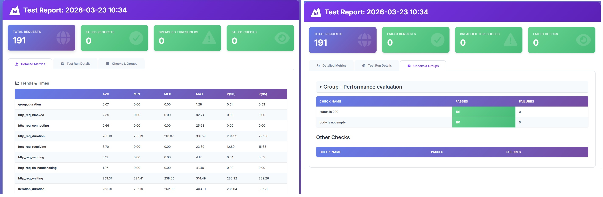

# k6 Performance Testing - Getting Started
This repository contains a basic setup for running load tests using k6, an open-source load testing tool from Grafana. (https://grafana.com/docs/k6/latest/)  
Follow the steps below to install k6, verify your setup, and run your first load test script.

### Prerequisites

A Windows system with Chocolatey installed.  
(If not installed, see: https://chocolatey.org/install)  
(Will work on other OS as well with relevant tools!)

### 1. Install k6

Since grafana k6 is the main component in this project it needs to be installed.  
Run the following command in an elevated PowerShell (Run as Administrator):  
`choco install k6`  
OR  
`winget install k6`  
Reference: https://grafana.com/docs/k6/latest/set-up/install-k6/

### 2. Verify Installation

Check the installed version of k6:  
`k6 version`  
If k6 is installed correctly, this will print out the version number.  
If there arise any issue in detecting k6, ensure k6 path is correctly added in system variable in the Environment variables settings.  

### 3. Ensure yarn and node.js are all ready

This project uses node.js to:  
1. run the TypeScript build pipeline (esbuild)  
2. execute the custom run.ts script that launches k6  
3.  load environment variables via dotenv

And Yarn is used as package managed.  

Use command to verify node and yarn version if added already:  
`node -v`  
AND  
`yarn -v`  

If not already set up, this will be a good time to do it.  

### 4. Create a New Repository

1. Create a new repository (local or Git-based).
2. Inside the repo, add a sample k6 script file named:  
`script.js`  
This file will contain your test script. (TypeScript can be used, refer the end of readme to know more!)

### 5. Create Your First Test Script

Use the sample code provided by Grafana's documentation.  
Link: https://grafana.com/docs/k6/latest/get-started/running-k6/  
Example script.js (you may modify as needed):
```bash
import http from 'k6/http';
import { sleep } from 'k6';

export default function () {
  http.get('https://test.k6.io');
  seep(1);
}
```

### 6. Run the Test Script
Execute your script using:  
`k6 run script.js`  
OR  
`k6 run script.js --vus 10 --duration 30s`  
(to include virtual user and test duration)

k6 will start the test and show results directly in your console/terminal.

### 7. Running the script in typescript

Slight modification which is described in the know more section is done.
With that and new .ts test file in place and after building the project once, execute below command to run tests:  
`yarn start`  

## Set up the project structure

Add configs for setting up node_modules, typescript, k6, esbuild, glob.  
ESBuild will help convert the .ts test scripts to .js files which k6 understands and will be available in the /output folder after build runs. 

### TypeScript + esbuild

The project compiles .ts test scripts into runnable .js files using esbuild.

Install dependencies:  
`yarn install`  

Build the project:  
`yarn build`  

### For generating reports
To generate comprehensive performance reports, open source project 'k6-reporter' is used.   
(Link: https://github.com/benc-uk/k6-reporter)  
An html report file will be generated, now it is saved as "*summary.html*"
   
Sample report will look like:  


## Good to know - Updates to support TypeScript usage  

k6 by default support only javascript. In order to use TypeScript a few updates were done, for example:  

1. Added new build pipeline (described in 'tools/esbuild.config.mjs'), discovered by glob.
2. Added a TypeScript runner (run.ts), to avoid manual compile step.
3. TypeScript config specific to k6 (tsconfig.json).
4. Switched node project to ESM (type:module)
